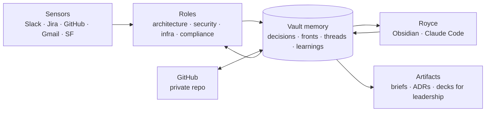

> Vault copy of the plan. The collaborative, commentable version is the [Claude doc](https://claude.ai/code/artifact/3b82f615-f9ec-4a42-935a-a22ec84d68d0); this note is re-exported from it when the plan changes. Decisions referenced here live in `Decisions/` ([[DEC-0001 Vault sync model]], [[DEC-0002 Identity documents live outside the vault]], [[DEC-0003 GitHub credential for cloud roles]], [[DEC-0004 Review before history]]).

# Claude Working System

2026-09-18 · Royce Nobles

A living plan for how Royce works with Claude as Chief Architect at Ohanafy. Revised as the role and the system take shape.

## Purpose and north star

This system exists so that nothing across Royce's fronts falls through a crack, and so that decisions and learnings compound instead of evaporating in daily notes. It serves one company goal: taking Ohanafy from one customer go-live per year to twelve or more, through the Enterprise Delivery Model (90-day, no-custom-dev go-lives, Gulf as the template).

The role it supports is Chief Architect with CTO and CISO responsibilities forming around it, three weeks in, without a physical team. The fronts today are the Salesforce application (packaging, integrations, data volume), early AWS (tenancy, accounts, auth), the new field mobile app (Sept 28 milestone, thousands of users), security and compliance posture (SOC 2, ISO 27001/42001, SF security reviews), and the AI strategy (Big Kahuna, Agentforce, soft target Jan 1).

Every agent role, note structure, and standing job in this plan should be able to answer one question: how does this help get from one to twelve without breaking what already runs.

## Where things stand

The Ohanafy vault is small, fresh, and already showing the symptom: 18 notes, 27 open checkboxes scattered across 11 daily notes and 4 project notes, with no place where they are all visible at once. Surveyed read-only on 2026-09-18.

| Area | What is there | Observation |
| --- | --- | --- |
| Journal (11 notes, Aug 31 to Sep 17) | Meeting notes by leader, tasks, questions, raw observations | Richest content in the vault. Leadership meeting notes are detailed and decision-bearing, but nothing is extracted from them. Headings vary day to day (Today, Objectives, Work, Tasks, Notes). |
| Projects/Mobile Application | Progress log, prototype, launch brief, hardware breakdown, requirements link | The one note that compounds: dated progress entries, links to artifacts, named owners. This is the pattern to generalize. |
| Projects/Gulf Pilot | 90-day goal and focus areas | Clear north-star note, not yet linked from the journal or updated since creation. |
| Projects/Onboarding | Focus areas, outstanding questions, checklist, PR quotes | Outstanding Questions is a proto-decision-log: questions with owners. Nothing marks which are answered. |
| Projects/AI Strategy | Three bullets | A placeholder for a front the leadership team has a soft Jan 1 target on. |
| Configuration | Obsidian core plus calendar and folder-notes; daily notes to Journal | No Claude Code configuration, no git, no templates. A clean slate. |

Two things in the vault were more sensitive than the conversation assumed: a Verification Documents folder holding government ID images, the employment verification, and articles of incorporation (since moved to Bitwarden, see DEC-0002), and Sep 15 leadership notes carrying runway, churn, and revenue figures. Both shaped the write rule below.

Outside the vault, four Claude experiments have already run. Claude Code opened inside earlier vaults (felt chaotic, no structure to anchor to). A daily Slack scan producing an open-task report (worked, but isolated from the vault and blind to prior decisions). A scheduled Salesforce outage monitor (worked as a standing sensor). The compound engineering plugin for code work (the one that compounded, because it read from and wrote to a designated place). Claude sessions also have Slack, Jira, Gmail, Calendar, Gong, Salesforce (production and sandbox), the Ohanafy brand skills, and a link to the MacBook.

## Diagnosis

The problem is memory, not tooling. Every experiment that read live inputs and wrote nothing durable stayed a one-off; the one with a designated place to write back compounded. The Slack report cannot notice a deviation from a decision made two weeks ago because the decision was never written where the report could read it. The vault today organizes by time, and neither Royce nor an agent retrieves by time. That is why tasks vanish after the day they were written and why the leadership notes, the richest material in the vault, feed nothing.

The goals and the friction point in different directions. The friction says things fall through cracks and knowledge does not accumulate. The goal says connect every input and stand up a team of agents. Doing the second before the first multiplies the chaos: more inputs and more writers into a structure that has none. Sequencing has to be memory first, one reliable loop second, additional roles third.

The agents should share one brain, not be separate teams. An architecture role, a security role, and an infrastructure role are useful as charters (focus, standing instructions, what to watch). They are not useful as isolated actors. A security role that reads the decision log and the infrastructure notes is worth more than a brilliant isolated security agent.

There are two worlds and no bridge. Thoughts, diagrams, and Claude Code live in Obsidian on the Mac. The sensors (Slack, Jira, Salesforce, Gmail, Gong) and the ability to run work unattended live in the cloud. The Slack report felt isolated because it was. The bridge is the vault as canonical state, reachable from both sides.

Timing cuts both ways. Three weeks in, with the role still absorbing CTO and CISO duties, is too early to over-architect the system. But compounding only starts when decisions are written in retrievable form, and every week of leadership notes left unextracted is context that will not be recovered. So: a small stable core now, roles layered on as the role settles.

The vault already contains the right pattern once. The Mobile Application note (dated progress, linked artifacts, named owners, a quoted requirement at the top) is what every front should look like. The plan generalizes what already works rather than importing a system.

## Design principles

Seven rules, meant to survive changes in tools and in the role.

1. Memory before sensors, sensors before roles. Nothing reads from Slack, Jira, or email until there is a structured place for it to write to and a decision log for it to check against.
2. The vault is the canonical state. Obsidian is the reading and thinking surface. Claude sessions and Claude Code are the hands and the sensors. Anything an agent learns or decides that matters tomorrow is written into the vault, or it did not happen.
3. Two sync channels, two audiences. iCloud syncs the vault between Royce's devices and eyes. A private GitHub repo syncs the vault between the vault and the agents, so standing roles can run in the cloud whether or not the Mac is awake. GitHub wins a conflict. ([[DEC-0001 Vault sync model|DEC-0001]])
4. Roles share one brain. Each role has a charter (focus, what it watches, what it may write) and a recognizable commit identity, but all roles read the same decision log, the same front notes, and the same open-thread list.
5. Retrieval by topic and decision, never by date. Daily notes stay as capture, but nothing lives only in a daily note. Extraction into front notes, decisions, and open threads is a designed, non-optional step, the way compound engineering made write-back non-optional.
6. One write rule, and nothing to guard. Identity documents, contracts, and anything used to prove authority to a vendor live in the password manager, never in the vault, so there is no private folder to architect around ([[DEC-0002 Identity documents live outside the vault|DEC-0002]]). For everything else, agents follow a single line: do not write anything you found that Royce would not post in the leadership channel himself. The vault is a private repo read by people who already hold executive-level access; that is the bar.
7. Nothing enters history unreviewed. In interactive work Claude stages changes and Royce commits, so every diff is read in Warp before it becomes history. Unattended roles cannot wait for a reviewer, so they commit to their own branch and open a pull request; `main` holds only what Royce has approved. The PR is the review surface for agent work, the same one used for human contributors. ([[DEC-0004 Review before history|DEC-0004]])

## Proposed shape

Five layers, each one only useful once the one below it exists. This describes the system; it does not yet schedule it.

Everything flows through the vault. Roles read it before acting and write to it after; Royce reads it in Obsidian and writes to it directly or through Claude Code; shareable artifacts are rendered from it, not written beside it.

Information flows one way: capture, then extract, then front or decision, then status. The journal is immutable capture; processing marks it (a `processed` frontmatter list per day, and moved tasks become `[>]` forwarded with a link to their front) but never rewrites it. After processing, the journal holds no open tasks, so fronts are the only place open threads live ([[DEC-0005 Journal lifecycle|DEC-0005]], proposed). The vault's `CLAUDE.md` is the map every session reads first; it encodes the layout, the note shapes, this flow, and the working rules.

**Memory.** A small set of note types, each with a fixed shape so both Royce and agents can find and fill them. Fronts (one note per area of responsibility: Mobile, Salesforce platform, AWS, Security and compliance, Integrations, Data and cost, AI strategy), modeled on the existing Mobile Application note. Decisions (one note per decision: context, options, choice, consequences, date, who was told; the executive-layer equivalent of the ADRs the team already writes). Open threads (a single view of every unresolved task and question, wherever it was captured). Learnings (things that turned out to be true or false, the compound-engineering pattern applied to the whole role). People and systems (who owns what, what talks to what) as lightweight reference notes.

**Sensors.** Standing jobs that read an input and write to memory, never directly to Royce. The existing Slack task scan and the Salesforce outage monitor become the first two, rewired to read the decision log first and write findings to open threads and front notes. GitHub activity, Jira movement, and calendar are the natural next three.

**Roles.** Charters, not agents: a written focus, the fronts and inputs it watches, what it may write, and a commit identity. Architecture (drift against decisions, scaling risk, ADR review). Security and compliance (dependencies, licenses, security-review readiness, SOC 2 and ISO posture). Infrastructure (AWS accounts, tenancy, cost). The first role runs alone until it proves it writes useful things to memory; the others are added one at a time.

**Surface.** Obsidian, with a small number of generated views: today's open threads across all fronts, decisions made this week and who still needs to hear them, what each role wrote since Royce last looked. Claude Code inside the vault for thinking and drafting, with configuration that encodes the note shapes and write rules so every session behaves the same.

**Sharing.** Artifacts for other executives and team members rendered from vault content: architecture briefs, decision records, the Tuesday leadership update, decks. The Ohanafy brand skills already exist for this. Rendering is a step, not a system.

## Decisions to make

The decision log lives in the vault under `Decisions/`, one note per decision in ADR shape (context, options, decision, consequences, who was told). Four entries exist as of 2026-09-22; the rest are still open here.

| Decision | Options | Status | Why it matters now |
| --- | --- | --- | --- |
| Vault sync model | (a) iCloud for devices plus git for agents, GitHub wins conflicts; (b) git only; (c) Obsidian Sync plus git | Decided (a), [[DEC-0001 Vault sync model\|DEC-0001]]. Repo `roycenobles/ohanafy-vault`, `.gitignore` in place | Cloud roles can reach the vault whether or not the Mac is awake |
| Sensitive material boundary | (a) gitignored private folder; (b) sibling folder outside the vault; (c) password manager | Decided (c), [[DEC-0002 Identity documents live outside the vault\|DEC-0002]]. Files moved to Bitwarden; no private folder | Nothing sensitive left in the vault to architect around |
| Write rule for agents | Three tiers; or one line | Decided: one line, in DEC-0002 | Simple enough to be followed by every role without interpretation |
| Review before history | (a) Claude commits directly; (b) Claude stages, Royce commits; roles work on branches and open PRs | Decided (b), [[DEC-0004 Review before history\|DEC-0004]] | Every change is read before it becomes history; PRs are the review surface for unattended roles |
| GitHub credential for cloud roles | (a) proxy-injected credential, as Salesforce and Jira already are; (b) fine-grained token in the task configuration | Pending, [[DEC-0003 GitHub credential for cloud roles\|DEC-0003]]. Due when the first role runs unattended | Whichever path, scoped to one repo, contents only, with an expiry |
| Note shapes | Fronts, decisions, open threads, learnings, reference; or fewer to start | Open. Leaning: all five, templates for fronts and decisions first | Shapes are what make retrieval by topic work |
| Retrofit the journal | Extract Aug 31 to Sep 22 now; or start clean | Open. Leaning: extract once, as the first supervised task | 27 open items and decision-bearing leadership notes exist |
| First role | Architecture; security; or an open-threads keeper | Open. Leaning: keeper first, architecture second | The keeper is the smallest role that proves the memory loop |
| Where daily capture happens | Obsidian daily notes; Claude Code; both | Open. Leaning: keep daily notes, add extraction | Capture already works; extraction is what is missing |
| Claude Code configuration scope | Vault-level only; or shared with the engineering repos | Open. Leaning: vault-level first | Engineering already compounds through its own plugin |

Tooling settled alongside these: the Open in Terminal plugin (Warp) for deliberate git and Claude Code sessions inside the vault, with Obsidian Git to follow for the background commit loop (slow interval, disabled on mobile).

## Learning agenda

Three topics, deliberately few. Each is a prerequisite for a layer of the system, and each is worth a focused hour or two rather than a course.

**How persistence works across Claude's tools.** What a CLAUDE.md file does and where it is read from; how skills, agent definitions, and memory directories differ; what lives in a session's context versus what survives it; how the compound engineering plugin achieves its write-back, since that is the pattern to reproduce. This is the prerequisite for the memory layer and for making Claude Code inside the vault feel structured instead of chaotic.

**How scheduled tasks, connected folders, and a git-hosted vault fit together.** Each scheduled run starts fresh; what it can reach (a connected folder only while the Mac is linked, a GitHub repo always); how a run should read the decision log before acting and commit its findings after. This is the prerequisite for turning the Slack scan and the outage monitor from one-offs into sensors.

**The discipline side of second-brain systems.** Why most fail (capture is easy, review is never designed), how decision records work at the executive layer rather than the code layer, and how to structure notes for retrieval by topic and decision. The ADR tradition and the compound engineering plugin are the two nearest references; both already exist in Royce's practice. This is the prerequisite for the note shapes and the extraction step.

Deferred on purpose: multi-agent orchestration, custom plugins, and MCP server authoring. Each becomes relevant only after a single role has proven it writes useful things to memory.

## Open questions and next moves

The plan is deliberately not scheduled yet. These are the questions that would turn it into one, and the moves that make sense regardless of the answers.

- [ ] Which Claude plan is Ohanafy on, and what can organization admins see? (Royce to verify; lower stakes now that nothing sensitive is in the vault.)
- [ ] Does Royce want the extraction of the existing journal done by Claude as a first supervised task, or by hand as a way of designing the note shapes?
- [ ] Which front is most at risk of a decision being quietly contradicted in the next month? That front gets the first role.
- [ ] Is the Tuesday leadership update (noted Sep 1 as something Claude should help with) the first shared artifact to generate from the vault?
- [ ] Should the vault's Claude Code configuration be designed in conversation, or drafted by Claude for Royce to edit in Obsidian?
- [ ] Can GitHub be added to the organization's injected credentials, and is that Royce's call to make? (Feeds DEC-0003.)

Moves that do not depend on the answers:

1. ~~Move the verification documents out of the vault.~~ Done 2026-09-21; now in Bitwarden.
2. ~~Initialize the repo, push to a private GitHub repository, log the sync-model decision.~~ Done 2026-09-22; DEC-0001 through DEC-0003 in `Decisions/`.
3. Draft templates for two note shapes only: a front and a decision (the decision shape now exists by example in DEC-0001).
4. Write the vault's Claude configuration to encode the note shapes and the one-line write rule.
5. Extract the journal (Aug 31 to Sep 22) into fronts, decisions, and open threads, supervised.
6. Only then: point the existing Slack scan at the vault.
